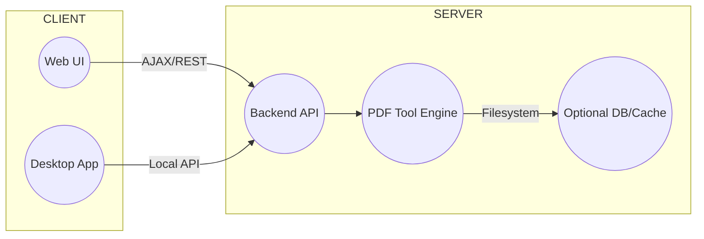

# 【开源项目】Stirling-PDF：一站式开源 PDF 处理平台

在数字化办公日益普及的今天，PDF文件处理已成为我们日常工作中不可或缺的一部分。然而，市面上琳琅满目的PDF工具往往功能单一、操作复杂，或是伴随着高昂的订阅费用和数据隐私风险。

**Stirling PDF** 是当前 GitHub 上最受欢迎的开源 PDF 平台之一。它不仅功能强大、操作简便，更以其开源的特性和灵活的部署方式，为用户提供了前所未有的自由与安全。无论您是技术爱好者、开发者，还是需要高效处理PDF的普通用户，Stirling-PDF都将是您不可多得的得力助手。

>  项目地址：https://github.com/Stirling-Tools/Stirling-PDF


## 1. 项目简介

Stirling-PDF是一款功能丰富、基于Web的开源PDF操作工具，旨在提供一个全面且用户友好的平台，以满足各种PDF处理需求。它允许用户在任何设备上，通过浏览器轻松编辑、合并、拆分、签署、修订、转换PDF文件，甚至支持OCR（光学字符识别）功能。Stirling-PDF的核心价值在于其**本地化部署能力**，用户可以将其作为桌面应用程序、浏览器应用或私有服务器上的服务运行，从而确保了数据隐私和安全性，避免了将敏感文档上传至第三方服务的风险。


## 2. 核心功能与技术亮点

Stirling-PDF凭借其强大的功能集和先进的技术架构，在众多PDF工具中脱颖而出。以下是其主要功能和技术亮点：

### 2.1 丰富多样的PDF处理工具

Stirling-PDF提供了超过50种PDF处理工具，涵盖了从基础编辑到高级操作的各种需求，包括但不限于：

*   **编辑与管理**: 合并、拆分、重新排序、旋转、删除页面、添加水印、添加图片、添加空白页等。
*   **转换**: PDF与其他格式（如图片、HTML、Word、Excel）之间的相互转换。
*   **安全与隐私**: 加密、解密、修订（涂黑敏感信息）、签署PDF、添加密码保护。
*   **自动化**: 支持通过API和可视化管道（Pipeline）功能，实现PDF处理的自动化工作流。
*   **高级功能**: OCR文本识别、压缩PDF、修复PDF、比较PDF等。

### 2.2 灵活的部署与访问方式

Stirling-PDF提供了多种部署和访问选项，以适应不同用户的需求：

*   **桌面客户端**: 通过Tauri框架打包，用户可以将其作为独立的桌面应用程序运行，享受原生应用般的流畅体验。
*   **Web UI**: 作为基于Web的应用程序，用户可以通过任何现代浏览器访问其直观的用户界面。
*   **私有服务器部署**: 支持Docker部署，用户可以在自己的服务器上搭建Stirling-PDF服务，完全掌控数据。
*   **API集成**: 提供全面的RESTful API接口，方便开发者将其功能集成到现有系统或自定义应用中。

### 2.3 技术栈概述

Stirling-PDF的强大功能得益于其稳健的技术栈。项目主要采用**Java**和**TypeScript**进行开发，具体技术构成如下：



*   **后端**: 基于**Spring Boot**框架，利用Java的稳定性和生态系统，处理核心PDF操作逻辑和API服务。
*   **前端**: 采用**React**框架和**TailwindCSS**，构建现代化、响应式的用户界面，提供卓越的用户体验。
*   **桌面应用**: 结合**Tauri**框架，将Web前端打包成轻量级的跨平台桌面应用，无需浏览器即可运行。
*   **PDF处理库**: 核心PDF操作可能依赖于Apache PDFBox等成熟的Java PDF库。
*   **容器化**: 通过**Docker**提供便捷的部署方案，实现环境隔离和快速启动。
*   **构建工具**: 使用**Gradle**管理项目依赖和构建流程。

这种前后端分离、多端部署的架构设计，确保了Stirling-PDF的高性能、可扩展性和易维护性。


## 3. 安装与使用指南

### 3.1 安装

#### 1. 桌面应用程序

| 平台                    | 下载                                                   | 文档                                                         |
| ----------------------- | ------------------------------------------------------ | ------------------------------------------------------------ |
| **Windows**             | https://files.stirlingpdf.com/win-installer.exe        | https://docs.stirlingpdf.com/Installation/Windows%20Installation |
| **Mac (Apple Silicon)** | https://files.stirlingpdf.com/mac-installer.dmg        | https://docs.stirlingpdf.com/Installation/Mac%20Installation |
| **Mac (Intel)**         | https://files.stirlingpdf.com/mac-x86_64-installer.dmg | https://docs.stirlingpdf.com/Installation/Mac%20Installation |
| **Linux**               | https://files.stirlingpdf.com/linux-installer.deb      | https://docs.stirlingpdf.com/Installation/Unix%20Installation |

#### 2. Docker部署方式：

1. **确保已安装Docker**: 如果您的系统尚未安装Docker，请访问[Docker官方网站](https://www.docker.com/get-started)获取安装指南。
2. **运行Stirling-PDF容器**: 打开终端或命令行工具，执行以下命令：

   ```shell
   docker run -p 8080:8080 docker.stirlingpdf.com/stirlingtools/stirling-pdf
   ```

3. **访问Web界面**: 容器启动后，在您的浏览器中打开 [http://localhost:8080](http://localhost:8080) 即可访问Stirling-PDF的用户界面。

### 3.2 使用指南


## 4. 解决痛点

Stirling-PDF的出现，有效解决了当前PDF处理领域的诸多痛点，并以其独特的优势吸引了大量用户：

*   **数据隐私与安全**: 最大的亮点在于其**本地化部署**能力。用户无需将敏感文件上传到外部服务器，所有操作都在本地或私有环境中完成，极大地保障了数据安全和隐私。
*   **功能全面且免费开源**: 提供企业级的功能，但完全免费且开源。这使得个人用户和小型团队能够以零成本享受到专业级的PDF处理服务。
*   **操作简便，用户友好**: 直观的Web界面设计，使得即使是技术小白也能轻松上手，快速完成复杂的PDF操作。
*   **高度可定制与集成**: 开放的API接口和开源代码，为开发者提供了无限的定制和集成可能性，可以根据特定需求进行二次开发。
*   **跨平台支持**: 无论是Windows、macOS、Linux，还是通过Docker部署在服务器上，Stirling-PDF都能稳定运行。


## 5. 目标受众

Stirling-PDF的目标受众广泛，包括：

*   **技术爱好者与开源社区成员**: 对开源项目充满热情，乐于探索和贡献的个人。
*   **开发者**: 需要将PDF处理功能集成到自己的应用程序中，或希望基于Stirling-PDF进行定制开发的工程师。
*   **技术小白与普通用户**: 寻求免费、易用、功能全面的PDF工具，以提高工作效率的个人和小型团队。
*   **企业用户**: 关注数据安全和隐私，希望在内部环境中部署PDF解决方案的企业。


## 6. 未来展望

Stirling-PDF的未来发展充满潜力。项目团队可能会在以下几个方向进行探索和扩展：

*   **更丰富的功能**: 持续集成更多高级PDF处理功能，如更智能的表单填写、更强大的文档分析等。
*   **AI集成**: 探索与人工智能技术的结合，例如利用AI进行文档内容理解、智能摘要生成或自动化分类。
*   **性能优化**: 进一步提升处理大型PDF文件时的性能和效率。
*   **生态系统建设**: 吸引更多开发者参与，共同构建围绕Stirling-PDF的插件和扩展生态系统。
*   **用户体验优化**: 不断迭代和改进用户界面，使其更加直观和易用。

Stirling-PDF致力于成为未来PDF处理领域的标杆，为用户提供更加智能、高效和安全的解决方案。


## 📬 关注我 · 获取更多内容

### **📌 南墨的技术小栈**


这里是我的个人知识分享空间。我会定期整理和分享工作与学习中积累的经验与资源，内容涵盖：

- 算法分享 —— 深入讲解算法原理、实现思路与代码示例。
- 工具分享 —— 推荐实用工具与脚本，包括我个人开发的小工具和精选开源工具。
- 开源项目 —— 精选 GitHub 上高星项目，拆解原理、使用方法和最佳实践。
- 数据分享 —— 工作学习中收集整理的数据资源。

无论你是技术爱好者、算法研究者，还是对数据与开源感兴趣的朋友，这里都希望能成为你学习、探索和实践的参考空间。

若在阅读或使用过程中有任何疑问，欢迎在公众号私信我，我会尽快与您交流。
