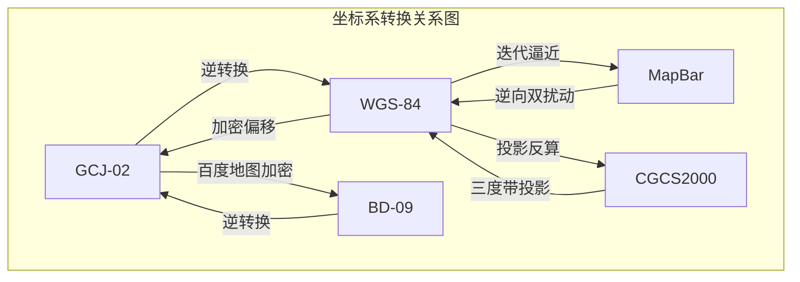

# 坐标系转换

在使用地图服务、构建轨迹分析模型或进行车联网数据处理时，最容易遇到的一个问题就是：**坐标系到底是什么？为什么同一个点在不同地图上位置会偏？**

常见的坐标系包括 **WGS-84、GCJ-02、BD-09、CGCS2000、MapBar** 等。如果不了解其差异，在轨迹计算、里程估算、POI 匹配、多源数据融合时都会产生误差。

本文将系统介绍主流坐标系的特点、使用场景，以及它们之间的转换流程图。


## 1. 为什么会有多个坐标系？

核心原因包括：

- 全球与国家制定的不同大地坐标基准
- 商业地图公司基于国家坐标进行的偏移加密
- 测绘密级制度要求（例如国内 GCJ-02 必须加密）
- 历史软件、老旧车载终端的遗留问题

因此，在进行可视化、分析、落图前确定 “**坐标系统**” 非常关键。


## 2. 主流坐标系详解

### 2.1 WGS-84 —— 全球通用 GPS 坐标系

**全称：World Geodetic System 1984**
**用途：全球定位系统（GPS）、北斗、GNSS 原始输出坐标**

#### 特点

- 全球标准坐标系
- Google Maps 国际版使用
- 车联网定位设备原始输出一般为 WGS84

### 2.2 GCJ-02 —— 火星坐标系（中国国家地理加密坐标）

**由国家测绘地理信息局制定**，用于中国境内互联网地图强制使用。

#### 特点

- 在 WGS-84 基础上加密偏移
- 国内地图（非百度）必须采用
- 点位与真实位置存在百米级别偏移

#### 使用者

- 高德地图
- 腾讯地图
- Google Maps 中国版
- 大部分国内互联网 LBS 服务

### 2.3 BD-09 —— 百度地图专用坐标系

百度在 GCJ-02 基础上再次加密，形成 BD-09。

#### 特点

- 二次加密
- 偏移不同于 GCJ-02
- 百度生态特有

#### 使用者

- 百度地图 Web / APP
- 百度鹰眼轨迹系统

### 2.4 MapBar 坐标系——图吧坐标

图吧地图早期采用的私有偏移坐标。

#### 特点

- 私有加密算法，未公开
- 偏移量与 GCJ-02、BD-09 均不同
- 旧系统中仍可能遇到

### 2.5 CGCS2000 —— 中国国家大地坐标系

**全称：China Geodetic Coordinate System 2000（CGCS2000）**
 是我国最新统一的大地坐标基准系统，用于测绘、地理信息、导航等领域。

#### 特点

- 国家级高精度大地基准
- 为我国北斗导航系统量身构建
- 和 WGS-84 非常接近（差异仅厘米级）
- 不偏移、不加密，是真实物理坐标

#### 使用者

- 北斗卫星导航系统（BD）
- 国家测绘局官方测绘成果
- 精准测量、GIS、国土/政务平台
- 许多新型高精度定位设备已输出 CGCS2000

#### 为什么它和 WGS84 表面“差不多”？

因为两者都基于地球椭球模型，CGCS2000 本质上是 WGS-84 的中国自主实现版本。
**差异小到个人设备无法察觉**，但在专业测绘中意义重大。


## 3. 各地图平台使用的坐标体系一览

| 数据源 / 地图平台  | 坐标系                |
| ------------------ | --------------------- |
| GPS、北斗原始定位  | **WGS-84 / CGCS2000** |
| Google Maps 国际版 | **WGS-84**            |
| Google Maps 中国版 | **GCJ-02**            |
| 高德（AMap）       | **GCJ-02**            |
| 腾讯地图           | **GCJ-02**            |
| 百度地图           | **BD-09**             |
| OpenStreetMap      | **WGS-84**            |
| 图吧 MapBar        | **MapBar 私有坐标**   |


## 4. 坐标系之间的转换

### **4.1 统一坐标系转换总览（流程图）**



核心原则：

- **国内地图展示（高德/腾讯） → GCJ02**
- **百度地图 → BD09**
- **分析计算（距离/速度/里程等算法）→ WGS84更精准**

### 4.2 代码

完整python代码放到了github上，实现了以下中国主流地图坐标系之间的完整互相转换，包括：

   - WGS84：全球 GPS 坐标 
   - GCJ02：火星坐标/国测局坐标
   - BD09：百度坐标系
   - MapBar：图吧私有加密坐标 
   - CGCS2000： 三度分带投影坐标

**[获取完整代码](https://github.com/xuenann/Tech-Cabin-Python/tree/main/%E7%AE%97%E6%B3%95%E5%88%86%E4%BA%AB/1-%E5%9D%90%E6%A0%87%E7%B3%BB%E8%BD%AC%E6%8D%A2)**

或

https://github.com/xuenann/Tech-Cabin-Python/ 项目中搜索：坐标系转换

```python
# wgs84 和 gcj02 坐标系转换代码示例：

def gcj02_to_wgs84(lng, lat):
    """GCJ02 -> WGS84"""
    dlat = transform_lat(lng - 105.0, lat - 35.0)
    dlng = transform_lng(lng - 105.0, lat - 35.0)
    radlat = lat / 180.0 * PI
    magic = math.sin(radlat)
    magic = 1 - EE * magic * magic
    sqrtmagic = math.sqrt(magic)
    dlat = (dlat * 180.0) / ((A * (1 - EE)) / (magic * sqrtmagic) * PI)
    dlng = (dlng * 180.0) / (A / sqrtmagic * math.cos(radlat) * PI)
    lng, lat = lng - dlng, lat - dlat
    return lng, lat

def wgs84_to_gcj02(lng, lat):
    """WGS84 -> GCJ02"""
    dlat = transform_lat(lng - 105.0, lat - 35.0)
    dlng = transform_lng(lng - 105.0, lat - 35.0)
    radlat = lat / 180.0 * PI
    magic = math.sin(radlat)
    magic = 1 - EE * magic * magic
    sqrtmagic = math.sqrt(magic)
    dlat = (dlat * 180.0) / ((A * (1 - EE)) / (magic * sqrtmagic) * PI)
    dlng = (dlng * 180.0) / (A / sqrtmagic * math.cos(radlat) * PI)
    lng, lat = lng + dlng, lat + dlat
    return lng, lat
```

### 4.3 各坐标系的偏移示例

以北京天安门广场为例

- WGS84：116.391349,39.907375
- GCJ02：116.397590,39.908776
- BD09：116.403963,39.915119
- MapBar：116.38681900000007,39.908185


**WGS84**：基准点，无偏移

**GCJ02**：往东北偏 300–800m

**BD09**：比 GCJ02 再往东北偏 50–100m


## 5. 如何判断数据是哪个坐标系？

#### 方式 1：看来源

- 北斗/GPS → WGS84 或 CGCS2000
- 高德 API → GCJ02
- 百度 API → BD09

#### 方式 2：用地图落点偏移判断

- WGS84 直接落到高德 → 点偏东偏北
- GCJ02 落百度 → 偏几米
- MapBar → 大偏移

#### 方式 3：看设备/接口文档

专业设备多支持 **CGCS2000** 输出。


## 6. 车联网 / GIS / 大数据处理中的建议

结合你车联网算法与模型研发场景：

#### 多源轨 迹融合

→ 建议统一转为 **WGS84** 再计算速度/距离
 （避免火星加密导致误差）

#### 地图展示

→ 按地图要求输出

- 高德/腾讯 → GCJ02
- 百度 → BD09

#### 静态点位（充电站/维修点/停车场）

→ 建议落库时保留 `坐标类型：coord_type` 字段


## 7. 总结

| 坐标系       | 特点                               | 使用场景                   |
| ------------ | ---------------------------------- | -------------------------- |
| **WGS-84**   | 全球 GPS 标准                      | 国际地图、车联网原始数据   |
| **CGCS2000** | 中国高精度大地基准                 | 北斗、高精度测绘、政务平台 |
| **GCJ-02**   | 国内互联网地图统一标准（火星加密） | 高德/腾讯/国内 Google      |
| **BD-09**    | 百度二次加密坐标                   | 百度地图全生态             |
| **MapBar**   | 私有偏移坐标                       | 老旧图吧系统               |

